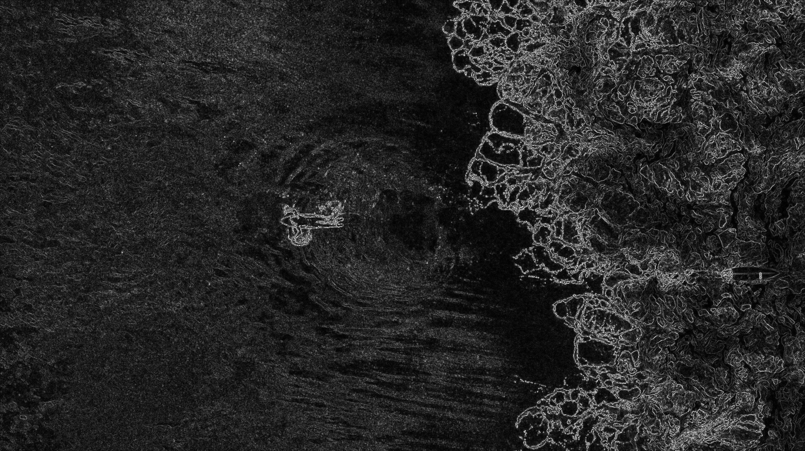
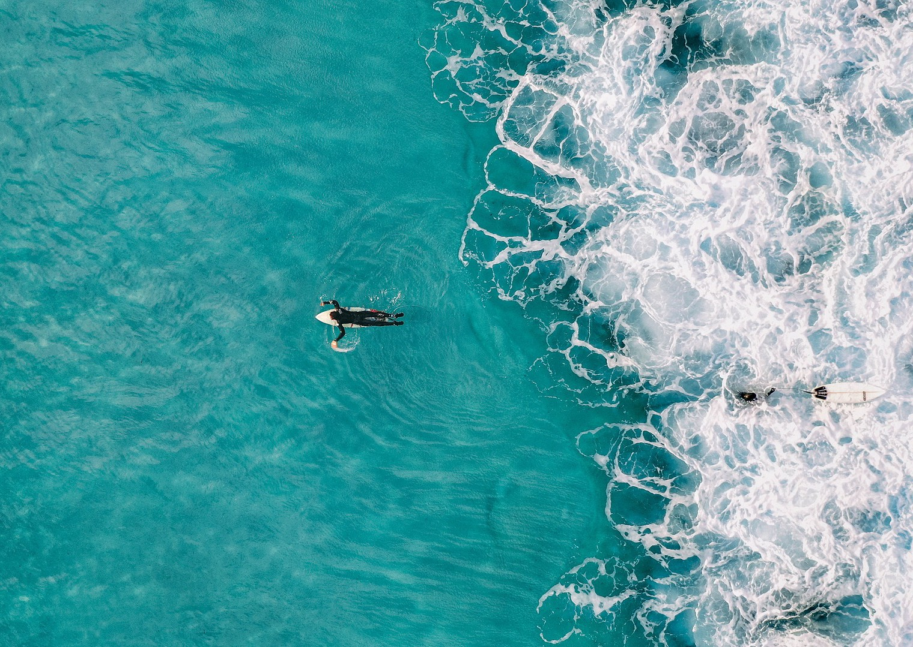

# Seam Carving

### Energy Calculation

Energy calculation is performed by computing the difference between the intensities
of RGB values between the pixels on either side of a pixel.

This creates an image which highlights the outlines of subjects in the image and hides 
regions of the image which don't have any details

### Seam Carving

After calculating the energy values of each pixel, we can identify a seam of pixel
vertically which are connected and have the lowest cumulative energy value. That seam
of pixels represent a part of the image which has very few distinguishing features and 
can hence be removed from the image.

After repeating the process a few times, we can remove portions of the image which are 
unimportant and will get a final image which is resized/cropped in a content-aware manner

