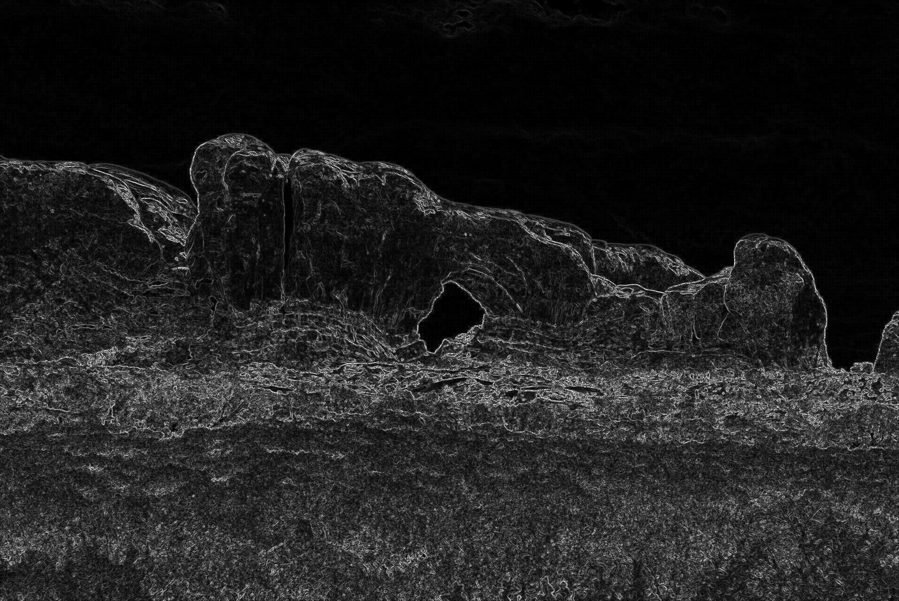
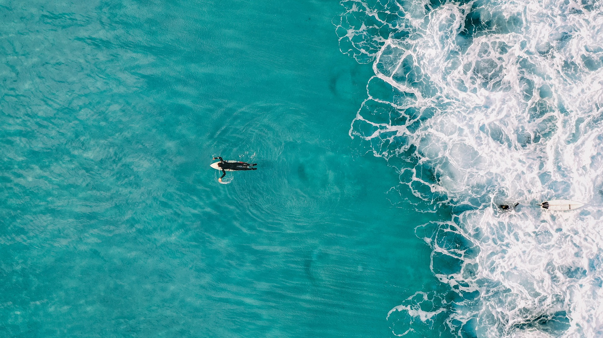

# Seam Carving

### Energy Calculation

Energy calculation is performed by computing the difference between the intensities
of RGB values between the pixels on either side of a pixel.

This creates an image which highlights the outlines of subjects in the image and hides 
regions of the image which don't have any details

